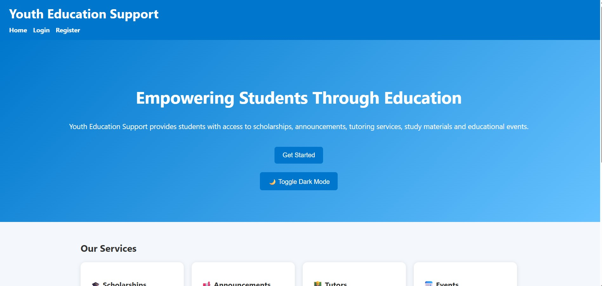
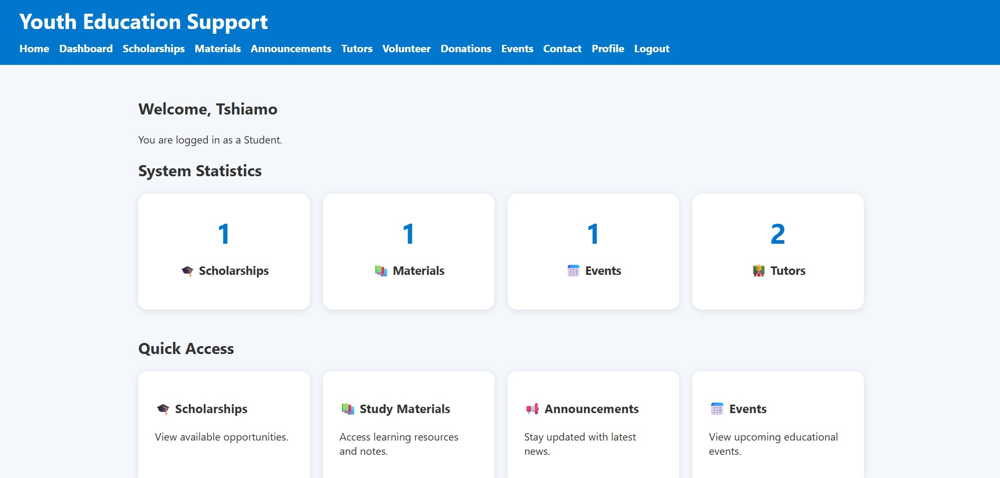
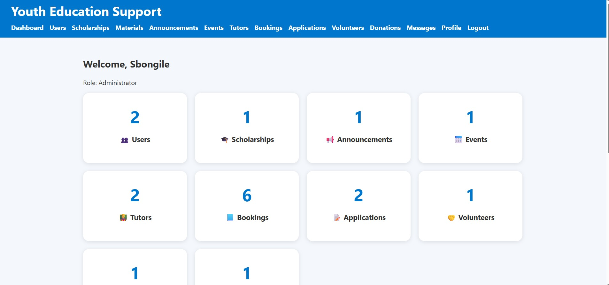
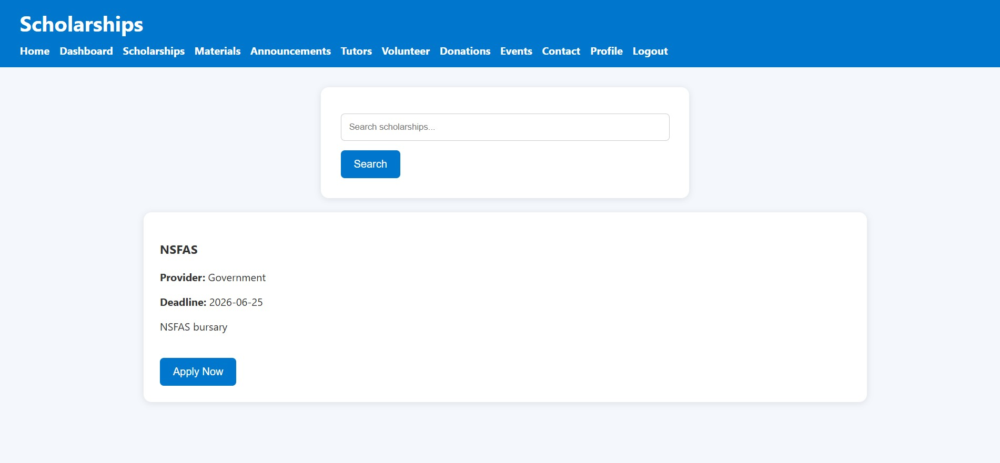
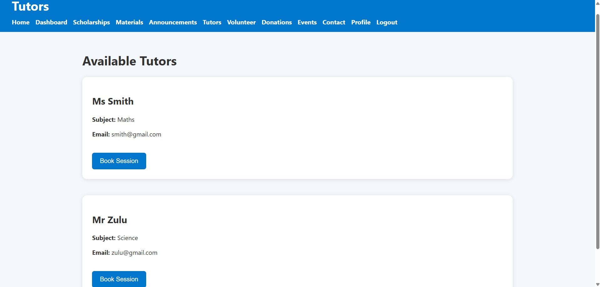

# Youth Education Support

## Project Overview

Youth Education Support is a web-based system developed to help students access educational opportunities, resources and support services.

The system allows students to:

- Register and login
- View and apply for scholarships
- Access study materials
- View announcements and events
- Book tutoring sessions
- Send messages
- Volunteer
- Make donations
- Manage their profiles

Administrators can manage all records through the admin dashboard.

---

## Technologies Used

- PHP
- MySQL
- HTML
- CSS
- JavaScript
- XAMPP

---

## Main Features

### Student Features

- Registration and Login
- Scholarship Applications
- Tutor Session Booking
- Study Materials
- Events
- Announcements
- Volunteer Registration
- Donations
- Profile Management

### Admin Features

- User Management
- Scholarship Management
- Tutor Management
- Event Management
- Announcement Management
- Volunteer Management
- Donation Management
- Contact Messages Management

---

## Database

The project uses MySQL.

Database file:

youtheducationsupport.sql

---

## Installation

1. Install XAMPP.
2. Start Apache and MySQL.
3. Import `youtheducationsupport.sql` into phpMyAdmin.
4. Copy the project folder into:

C:\xampp\htdocs\

5. Open:

http://localhost/YouthEducationSupport

---

## Authors

Developed by Group Members for XISD5319 Work Integrated Learning Project.
Group members:

ST10452101_Tshiamo Tumelo Simango
ST10172741-KEOAGILE LETLAPE
ST10354054 - Thoriso Maenetja
ST10387277 Khothatso Qobolo

## Screenshots

### Home Page

### Student Dashboard

### Admin Dashboard

### Scholarships

### Tutors

